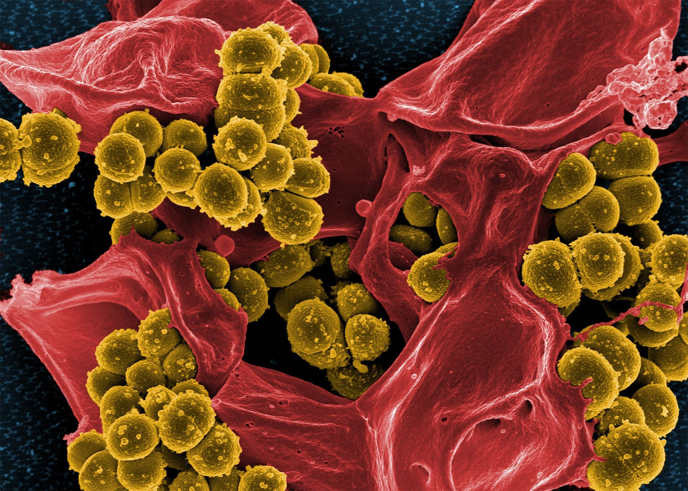
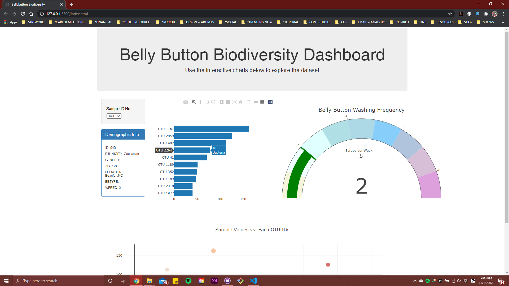
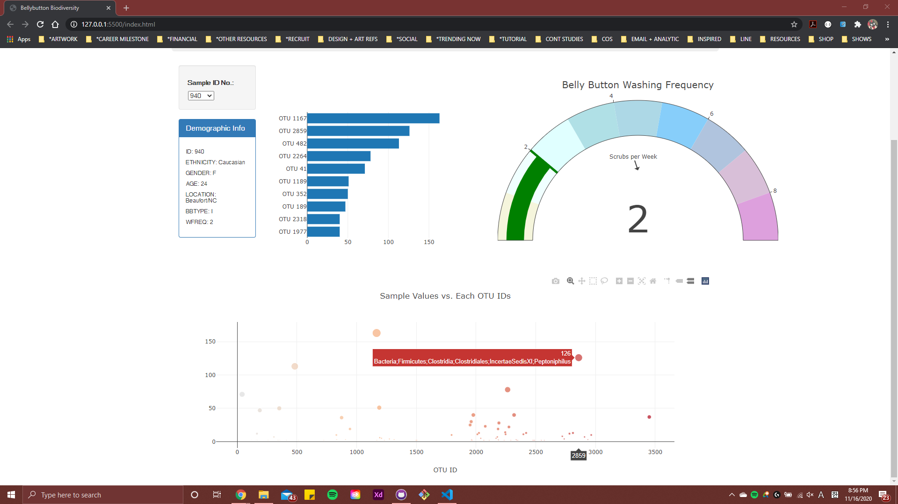
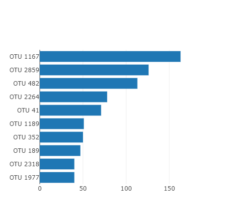
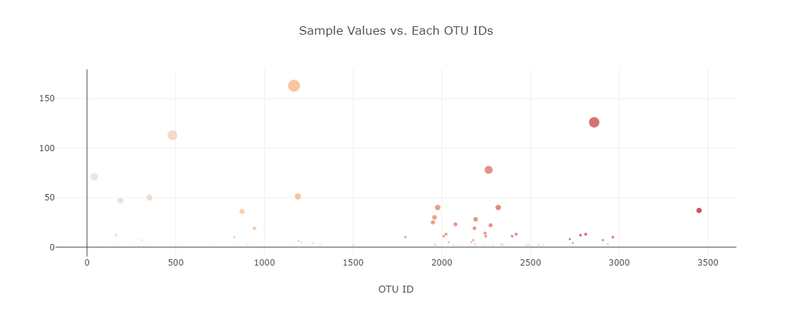
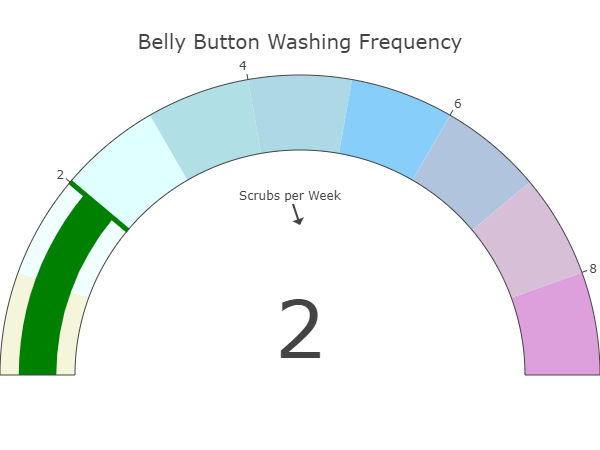

# Plotly Challenge Work - about Belly Button Biodiversity

For this project, we are building an interactive dashboard to explore the [Belly Button Biodiversity dataset](http://robdunnlab.com/projects/belly-button-biodiversity/), which gathers the microbes that colonize human navels.

This dataset shows that a small handful of microbial species (a.k.a. operational taxonomic units, or OTUs, in the study) were present in more than 70% of people, while the rest were relatively rare.

## Screenshots Of The Whole Project Layout

## Creating Data Visualization using Plotly

Compare OTUs of the individual sample.

Compare OTUs on all of samples in the bubble chart.

Compare Washing Frequency (how many times an individual sample washed per week). Some of samples have none or less than 7 washes per week, which it made me feel really grossed out. Also, some of samples have null, which we could take an estimated guess that a sample did not provided washes per week.

### Sources Used For The Data:

Hulcr, J. et al.(2012) _A Jungle in There: Bacteria in Belly Buttons are Highly Diverse, but Predictable_. Retrieved from: [http://robdunnlab.com/projects/belly-button-biodiversity/results-and-data/](http://robdunnlab.com/projects/belly-button-biodiversity/results-and-data/)

//

© 2020 Erika 