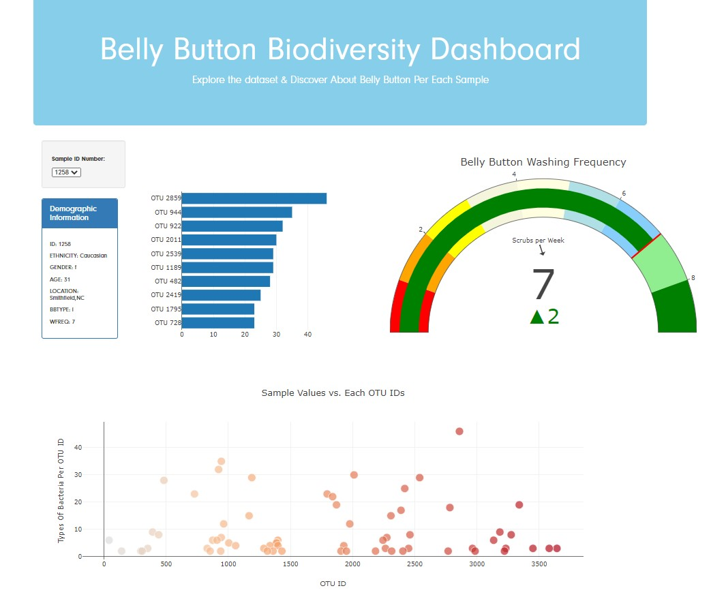
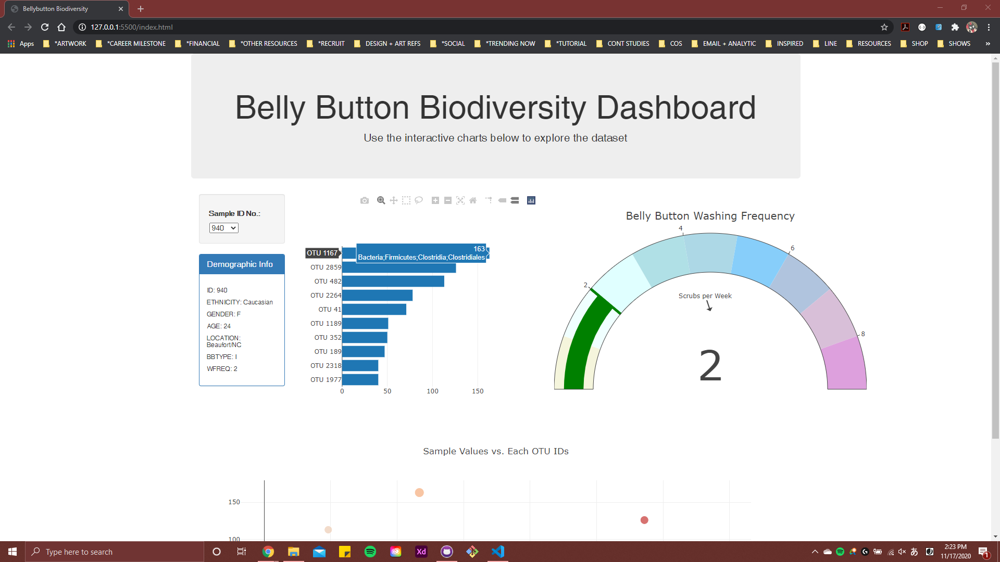
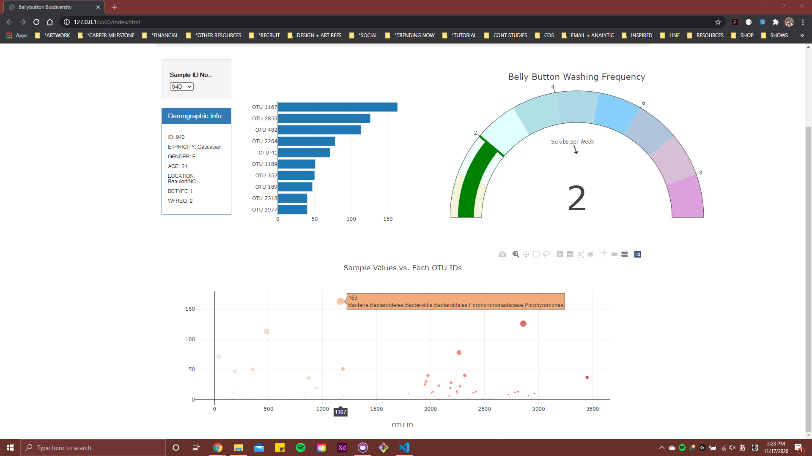
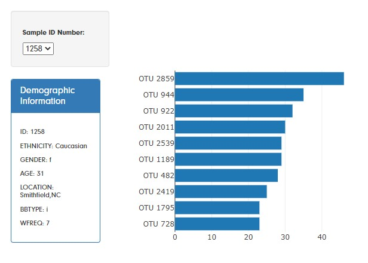
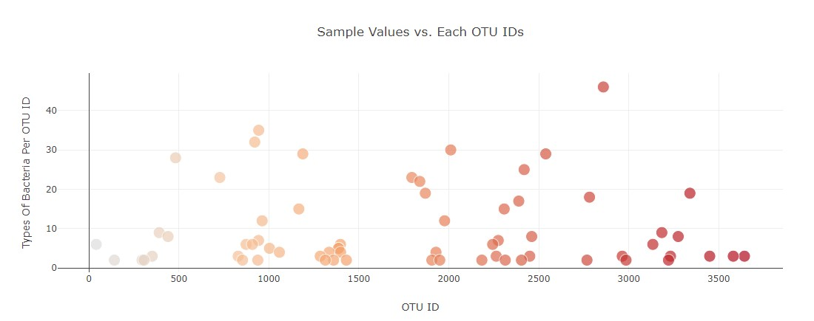
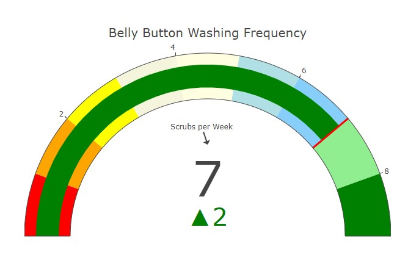

# Plotly Challenge Work - about Belly Button Biodiversity

<!--  -->

For this project, we are building an interactive dashboard to explore the [Belly Button Biodiversity dataset](http://robdunnlab.com/projects/belly-button-biodiversity/), which gathers the microbes that colonize human navels.

This dataset shows that a small handful of microbial species (a.k.a. operational taxonomic units, or OTUs, in the study) were present in more than 70% of people, while the rest were relatively rare.

## Screenshots Of The Whole Project Layout

<!--  -->
<!--  -->

## Demo
https://user-images.githubusercontent.com/68488125/151047992-7893694a-452b-47b0-b03b-0716fb82f306.mp4

## Data Viz using Plotly

Compare OTUs of the individual sample.

<!--  -->

Compare OTUs on all of the samples in the bubble chart.

<!--  -->

<!-- Compare Washing Frequency (how many times an individual sample washed per week). Some of the samples have none or less than seven washes per week, which means that most people in this data don't wash their belly button frequently. Also, some of the samples have null values, which we could take an estimated guess that there could be some missing data.  -->

<!--  -->

### Sources Used For The Data:

Hulcr, J. et al.(2012) _A Jungle in There: Bacteria in Belly Buttons are Highly Diverse, but Predictable_. Retrieved from: [http://robdunnlab.com/projects/belly-button-biodiversity/results-and-data/](http://robdunnlab.com/projects/belly-button-biodiversity/results-and-data/)

//

© 2020 Erika K. Yi
